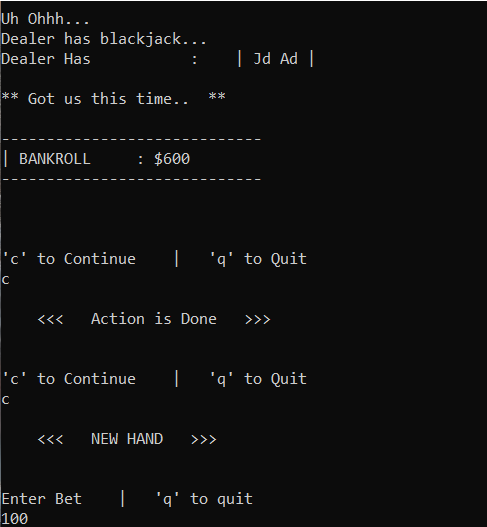

# TODO

## Completed

- [x] Handle error where putting too many funds twice
- [x] Implement rules - 'r' in action()
- [x] Handle input of capital letters everywhere where a char is input from stdin
- [x] Make hashmaps static for Card class
- [x] decide on README.md header sizes
- [x] Remove TODO section from README.md
- [x] figure out where to put/remove **Notes:** - Putting them in ideas in TODO.md
- [x] Create testing mode capabilities
  - [x] Choosing player hand
  - [x] Choosing hit card
  - [x] Choosing dealer hand
- [x] Put new screenshots in their own dated folder on github  
- [x] complete the features list on README.md
- [x] complete the blackjack rules list on README.md
- [x] Get new screenshots with the new (much better looking) lowercase  
- [x] Add ability for user to add more funds without having busted first
- [x] Replace menu option "surrender" with add funds after this hand
- [x] Sad face on loss, maybe in a box like the winnings, or some ascii art
- [x] check getting bj against dealer's bj in multiplayer and single player
- [x] Explain about the shuffling algorithm I'm using in README.md
- [x] Add function that converts any dollar amount to a string with commas for printing  
- [x] Add commas if necessary to cash balances printed (bankroll, hand winning, etc)
- [x] Add table limits (max bet size of MAX_RELOAD)
- [x] complete info on counting cards in general on README.md
- [x] in 1 player: user splits hand, the "You win $X" statement needs a newline after it if there is more than 1 hand left. Maybe add new line in either case
- [x] Move print stmt of "Computer Action to computerAction() from main()  

## Incomplete

- [ ] **report of precisely when (and the count) the player did not do the right action**  
  - [ ] ***Option to print to file***
- [ ] Create new Utility class with static functions for things like converting int to string with commas, etc
  - [ ] Remove the current duplicate of addComma() and addComma_main()  
- [ ] Update demo screen recordings, screenshots (wrote this 8/21/22)
- [ ] Add some place to request a printout of the exact situations in which player made mistake on Basic Strategy actions
- [ ] Add way to tell which hand you are on when playing hands you have split - i.e. hand 3 / X
- [ ] Look at IMGui and openGL for graphics rendering. View github repo
- [ ] High score component to game.. ?  
- [ ] Add testing mode capabilities to splitting and dealer received cards
- [ ] Add count notices like "Count is high, maybe you should consider raising your bet"
- [ ] Handle computer player getting blackjack on a split hand - currently standing pat
- [ ] Implement change in basic strategy and info for adjusting betting patterns based on true count (the ratio)
- [ ] add ability for player to play multiple hands
- [ ] Put release out on Github - v0.1.0   (maybe -alpha)
- [ ] Add link at top of README.md for releases page (once I put out release)
- [ ] Move screenshots/ to images/screenshots/
- [ ] Fix situation in multiway hand with dealer hitting blackack - Two continue prompts occur. See screenshot below:
- [ ] Maybe reverse order of which hand is played first after splitting

## Ideas and Notes to self

- dimensions of terminal for screenshot images: 91 x 28
- Maybe add in words with a few microseconds delay for a hand won that spread across the console
- Require bets to be in $5 increments ??
- Have the game analyze player's betting patterns and offer advice
- Track the number of times the player deviated from the optimal play
- Worth trying for more intricate text graphics? Or just focus on real graphics?
